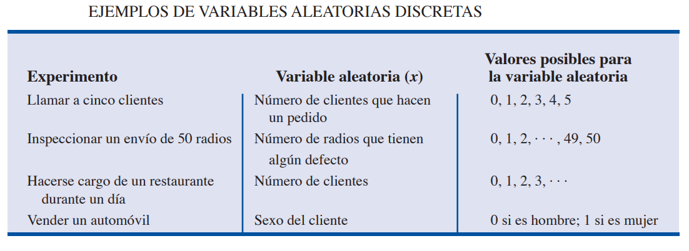
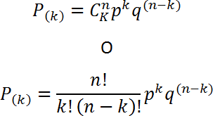

# Clase 1:

<br>

### Estadística

Estadística se refiere a datos numéricos, tales como promedios, medianas, porcentajes y números índices. Es el arte y la ciencia de reunir datos, analizarlos, presentarlos e interpretarlos.

<br>

### Estadística Descriptiva
Formato fácil de leer y de entender. Pueden ser tabulares, gráficos o numéricos.

<br>

### Estadística Inferencial
En muchas situaciones se requiere información acerca de grupos grandes de elementos. Debido a otras cuestiones, sólo es posible recolectar los datos de una pequeña parte de este grupo. <br>

Población == Grupo grande de elementos <br>
Muestra == Grupo pequeño de elementos <br>
Censo == Proceso de realizar un estudio para recolectar datos de toda una población. <br>
Encuesta Muestral == recolectar datos de una muestra. <br>

Una de las principales contribuciones de la estadística es emplear datos de una muestra para hacer estimaciones y probar hipótesis acerca de las características de una población mediante un proceso al que se le conoce como <b>inferencia estadística.</b>

<br>

### Distribución de frecuencias

La frecuencia es el número de casos que pertenecen a un valor determinado, ejemplo: La edad.<br>
Se pierde la individualidad se los datos, se presentan en categorías que agrupan a un conjunto de valores == intervalos. <br>


<br>

### Histograma

El Histograma es un gráfico de la distribución de frecuencias, que se construye con rectángulos de cada intervalo de la clase.<br>


<br>

# Clase 2:

<br>

### Combinaciones 

Contar el número de resultados experimentales.


Considere un procedimiento de control de calidad en el que un inspector selecciona al azar <b>2</b> de <b>5</b> piezas para probar que no tengan defectos.
N = 5 y n = 2 se tiene: <br>
5! / 2! * (5-2)! = 10. <br>
Resultados: AB, AC, AD, AE, BC, BD, BE, CD, CE y DE. <br>

<br>

### Permutaciones

Permite calcular el número de resultados experimentales coinsiderando el orden de selección como relevante. 


Con el mismo número de objetos, el número de permutaciones que se obtiene en un experimento es mayor que el número de combinaciones, ya que cada selección de n objetos se ordena de n! maneras diferentes.
<br>
5! / (5-2)! = 20.
<br>
Resultados: AB, BA, AC, CA, AD, DA, AE, EA, BC, CB, BD, DB, BE, EB, CD, DC, CE, EC, DE y ED.
<br>

<br>

### Interpretaciones de la probabilidad.

- La probabilidad asignada a cada resultado experimental debe estar entre 0 y 1, inclusive.
- La suma de las probabilidades de los resultados experimentales debe ser igual a 1.0.

<br>

### Corriente clásica:
Espacios muestrales uniformes. Se asignan probabilidades a eventos igualmente verosímiles. 
Se asigna la misma probabilidad a cada punto del espacio muestral.
<br><br>
Si lanzamos una moneda al aire, la probabilidad de obtener cara es 0.5 y de obtener cruz es 0.5, la probabilidad total es 1.
<br><br>
Si lanzamos un dado, cada lado tiene una probailidad de obtener cada lado es de 0.16666, (1/6) * 6 = 1. 
<br><br>

<br>

### Corriente frecuentista:
Frecuencia relativa con la cual se obtendría el evento. <br><br>
A menudo ocurre que alguno de estos datos, o ambos, resultan desconocidos o difíciles de conocer.

<br><br>
No es posible repetir una gran cantidad de veces algunos fenómenos, por ejemplo:
  a) Para calcular la probabilidad de que el lanzamiento de un cohete resulte exitoso, evidentemente no es posible realizar una gran cantidad de lanzamientos de cohetes; por tanto, la probabilidad se obtiene en forma frecuentista del éxito de un lanzamiento.
  b) ¿Cómo calcular la probabilidad de que Manuel viva 70 años? ¿Cuáles serían las repeticiones?
  c) Para calcular la probabilidad de que Juan Pérez se case este año, tampoco podemos realizar una gran cantidad de repeticiones del experimento.
<br><br>

Considere, por ejemplo un estudio sobre los tiempos de espera en el departamento de rayos x de un hospital pequeño. Durante 20 días sucesivos un empleado registra el número de personas que están esperando el servicio a las 9:00 a.m.; los resultados son los siguientes:


Con el método de la frecuencia relativa, la probabilidad que se le asignará a cada resultado experimental para pacientes esperan el servicio, será:
- O pacientes --> 2/20 = 0.10
- 1 pacientes --> 5/20 = 0.25
- 2 pacientes --> 6/20 = 0.30
- 3 pacientes --> 4/20 = 0.20
- 4 pacientes --> 3/20 = 0.15

La suma total de las probilidades es igual a 1.

<br>

### Corriente subjetivista:
Es muy empleada en el estudio del análisis de decisiones.

La probabilidad asignada está sujeta al conocimiento que el científico tenga con respecto al fenómeno estudiado. De este modo, para un mismo experimento las probabilidades asignadas por diferentes estadistas pueden ser distintas. Por eso se llama: <b>Corriente subjetivista</b>

Por ejemplo, si en una empresa se está programando la logística de distribución de material final, la asignación de probabilidad de que los recorridos se realicen con éxito al no tener información de datos históricos, se puede asignar de forma subjetiva.

<br>

### Corriente bayesiana:
Probabilidades a los eventos después del experimento. 

Las probabilidades están basadas en el conocimiento de la ocurrencia de eventos

Probabilidad al evento de que el día 3 llueva. Información:
  a) Los días 1 y 2 de septiembre no llovió.
  b) Los días 1 y 2 de septiembre llegó un huracán a 400 kilómetros de distancia y llovió ambos días.

a) Probabilidad de que llueva: Baja
b) Probabilidad de que llueva: Alta

<br>

### Diferencia entre Estadística y Probabilidad.

La estadística se basa en:
 - Analizarlos y obtener conclusiones sobre fenómenos que ocurren aleatoriamente. 
 - Observación de hechos ocurridos para generar leyes o hipótesis generales.

Probabilidad:
 - Medir la frecuencia de un resultado determinado que casi siempre depende del azar.
 - Método deductivo para establecer patrones que determinen qué pasaria en condiciones estables.

Probabilidad: certidumbre sobre la ocurrencia de un evento.

<br>

### Cuantificar la incertidumbre.

El Espacio de muestreo:
se expresa con la letra S, son todos los resultados posibles de un experimento.

El espacio de muestreo de tirar una moneda será S= {cara,seca}.

ya que estas dos alternativas representan a todos los resultados posibles. Si en lugar de considerar el lanzamiento de una moneda, lanzamos dos monedas; uno podría pensar que el espacio de muestreo para este caso será S={ 2 caras,2 secas,cara y seca}.

<br>

# Clase 3:

<br>

### ESPACIOS MUESTRALES Y SUCESOS

Los elementos básicos de la teoría de la probabilidad son los resultados de un experimento aleatorio.
Un experimento es un ensayo que consta de uno o más intentos, cuyo resultado es la ocurrencia de <b>uno</b> de los varios resultados posibles.

Los siguientes son ejemplos de experimentos aleatorios porque cumplen con esas condiciones, acompañando en cada caso posibles resultados de la variable aleatoria a la cual dan origen: 

- Lugar de origen de los autos vendidos por la concesionaria: nacional e importado.
- Edades de los compradores de auto de la concesionaria.
- La forma de pago de un cliente: en efectivo, con tarjeta de crédito o con tarjeta de débito.

EVENTO == colección de puntos muestrales.

Resultados de un estudio en base a observación de frecuencias:


Asignación de probabilidades:


L = El evento de que el proyecto esté acabado en menos de 10 meses <br>
M = El evento de que el proyecto esté acabado en más de 10 meses <br>

PROBABILIDAD DE UN EVENTO == La probabilidad de cualquier evento es igual a la suma de las probabilidades de los puntos muestrales que forman el evento.


P(L) = P(2, 6) + P(2, 7) + P(3, 6) <br>
P(L) = 0.15 + 0.15 + 0.10 = 0.40

P(M) = P(3, 8) + P(4, 7) + P(4, 8) <br>
P(M) = 0.05 + 0.10 + 0.15 = 0.30

Con estas probabilidades, ahora puede informarle al administrador del proyecto las probabilidades siguientes: 
- Que dure menos de 10 meses es 0.40.
- Que dure más de 10 meses es 0.30. 

<br>

### Clasificación de los sucesos:

- Simple: es un evento que puede describirse con una característica única. <br> 
Ejemplos: el comprador tiene más de 40 años.

- Compuesto: es un evento que puede describirse con más de una característica. Es una combinación de eventos simples. <br> 
Ejemplo: el cliente compre un auto nacional y tenga 40 años o más.

<br>

### Sucesos Excluyentes.

Sucesos mutuamente excluyentes == no se pueden presentar simultáneamente. <br>
Ejemplo: auto, nacional o importado.

<br>

### Sucesos Compatibles.
Sucesos compatibles == pueden ocurrir al mismo tiempo. <br> 
Ejemplo: nacional <b> o </b> más de 40 años.

<br>

### Regla de la adición: 

Nos permite encontrar la probabilidad del evento “A ó B”: considera la ocurrencia de cualquiera de los eventos, evento A o evento B o ambos A y B.


<br>

### UNIÓN DE DOS EVENTOS
La unión de A y B es el evento que contiene todos los puntos muestrales que pertenecen a A o a B o a ambos. La unión se denota <b>A U B</b>


<br>

### INTERSECCIÓN DE DOS EVENTOS
Dados dos eventos A y B, la intersección de A y B es el evento que contiene los puntos muestrales que pertenecen tanto a A como a B.

LEY DE LA ADICIÓN
P(A U B) = P(A) U P(B) - P(A ∩ B)


### ### Observe que en la ley de la adición, los dos primeros términos P(A) + P(B), corresponden a los puntos muestrales en A U B.Pero, como los puntos muestrales que se encuentran en la intersección A ∩ B están tanto en A como en B, cuando se calcula P(A) + P(B), los puntos que se encuentran en A U B cuentan dos veces. Esto se corrige restando P(A ∩ B).

<br>

### Eventos mutuamente excluyentes

Eventos mutuamente excluyentes == no tienen puntos muestrales en común.

Mutuamente excluyentes == un evento ocurre, el otro no puede ocurrir.


La ley de la adición:
P(A U B) = P(A) + P(B) 

<br>

### Regla de la multiplicación:

Ley de la multiplicación, calcula la probabilidad de la intersección de dos eventos.

Si la probabilidad de A = 0.84 <br>
Probabilidad de B en A = 0.75 <br>
P(B ∩ A) = P(A) * P(B ∩ A)
0.84 * 0.75 = 0.63


<br>

### LEY DE LA MULTIPLICACIÓN PARA EVENTOS INDEPENDIENTES

P(A ∩ B) = P(A) * P(B) <br>
P(A ∩ B) = P(A) * P(B) = (0.80)*(0.80) = 0.64

<br>

### Sucesos Condicionales

Evento A cuya probabilidad es P(A). <br> 
Si obtiene información nueva relacionada, denotado por B. <br> 
Deseará volver a calcular la probabilidad del evento A. 

P(A | B) == “la probabilidad de A dado B”.

Condicionales == la ocurrencia de un suceso afecta la probabilidad de ocurrencia del otro.

<br>

### Sucesos Independientes

Eventos independientes == la ocurrencia de un evento no afecta la probabilidad de otro.

P(B/A) = P(B) <br>
se verifica que, si A y B son independientes: <br>
P(AyB) = P(A)*P(B).

<br>

# Clase 4:

<br>

### Distribuciones de probabilidad

Una variable aleatoria == suceso numérico cuyo valor se determina aleatoriamente.

La suma de las probabilidades de todos los resultados numéricos posibles debe ser igual a 1.

Las variables aleatorias se pueden clasificar en: 
 - Discretas (surgen de un proceso de conteo).
 - Continuas (surgen de un proceso de medición).

<br>

### Características de las Distribuciones de Probabilidad:

Las características generales de las distribuciones de probabilidad difieren según el tipo de variable aleatoria, discreta o continua, que se encuentre bajo estudio. 

Por otro lado existen ciertas normas a la hora de nombrar variables:

<br>

##### Variable discreta
###### Solo puede tomar valores aislados y separados entre sí. (0, 1, 2, 3, etc.)

<br>

### Si la variable aleatoria es discreta:

1. Puede tomar solamente algunos valores dentro de un intervalo definido.
2. Las probabilidades se representan con los símbolos pi o p(xi).
3. El gráfico de la distribución de probabilidad se denomina gráfico de bastones, por la particular forma que adopta la probabilidad al afectar sólo a determinados puntos del eje de la variable aleatoria xi.
4. Las probabilidades se calculan mediante la aplicación de las reglas provenientes de la teoría clásica de probabilidad como de fórmulas específicas.
5. La condición de cierre se verifica realizando la sumatoria de las probabilidades.
6. La distribución de probabilidad en el caso de una variable aleatoria discreta se denomina genéricamente función de probabilidad.


<br>

### Si la variable aleatoria es continua:
1. Puede tomar cualquier valor en un determinado campo de variación.
2. La probabilidad se representa con los símbolos fi o f(x).
3. En un punto la probabilidad no tiene sentido. Sólo tiene sentido en un intervalo particular de la variable aleatoria xi, por más pequeño que éste sea.
4. En el gráfico, la distribución de probabilidad se ve como una función continua f(x), y la probabilidad en sí misma, denominada A, se representa como un área entre los puntos x1 y x2.
5. La probabilidad se obtiene calculando la integral, según el criterio de Riemann, de la función f(x), entre los puntos x1 y x2.
6. La condición de cierre se verifica efectuando la integral de la función en todo el campo de variación de la variable aleatoria.
7. La denominación genérica de la distribución de probabilidad en el caso continuo es la de función de densidad debido a que se considera que las probabilidades adquieren densidad, es decir que se "adensan", convirtiéndose en áreas.


<br>

### Distribuciones de Probabilidad - Variables Discretas
Las distribuciones de probailidad que estudiaremos para <b> variables discretas </b> son: Binomial, Poisson e Hipergeométrica.

<br>

La variable aleatoria que interesa es... <br>
x = número de automóviles que llega a la caseta de peaje en un día. (0, 1, 2, etc.) 

<br>

### Distribución Binomial 

PROPIEDADES DE UN EXPERIMENTO BINOMIAL
 - El experimento consiste en una serie de n ensayos idénticos.
 - En cada ensayo hay dos resultados posibles. A uno de estos resultados se le llama éxito y al otro se le llama fracaso.
 - La probabilidad de éxito, que se denota p, no cambia de un ensayo a otro. Por ende, la probabilidad de fracaso, que se denota 1 - p, tampoco cambia de un ensayo a otro.
 - Los ensayos son independientes.

En un experimento binomial lo que interesa es el número de éxitos en n ensayos. Considera el experimento que consiste en lanzar una moneda cinco veces y observar si la cara de la moneda que cae hacia arriba es cara o cruz. Si desea contar el número de caras. ¿Presenta este experimento las propiedades de un experimento binomial? ¿Cuál es la variable aleatoria que interesa? Observe que:

1. El experimento consiste en cinco ensayos idénticos; cada ensayo consiste en lanzar una moneda.
2. En cada ensayo hay dos resultados posibles: cara o cruz. Se puede considerar cara como éxito y cruz como fracaso.
3. La probabilidad de éxito y la probabilidad de fracaso son iguales en todos los ensayos, siendo p=0.5 y 1-p=0.5.
4. Los ensayos o lanzamientos son independientes porque al resultado de un ensayo no afecta a lo que pase en los otros ensayos o lanzamientos.

Otro ejemplo, considera a un vendedor de seguros que visita a 10 familias elegidas en forma aleatoria. El resultado correspondiente de la visita a cada familia se clasifica como éxito si la familia compra un seguro y como fracaso si la familia no compra ningún seguro. Por experiencia, el vendedor sabe que la probabilidad de que una familia tomada aleatoriamente compre un seguro es 0.10. Al revisar las propiedades de un experimento binomial aparece que:
1. El experimento consiste en 10 ensayos idénticos; cada ensayo consiste en visitar a una familia.
2. En cada ensayo hay dos resultados posibles: la familia compra un seguro (éxito) o la familia no compra ningún seguro (fracaso).
3. Las probabilidades de que haya compra y de que no haya compra se supone que son iguales en todas las visitas, siendo p=0.10 y 1-p =0.90.
4. Los ensayos son independientes porque las familias se eligen en forma aleatoria.



p= probabilidad de éxito.
q= Probabilidd de fracaso.
n= espacio muestral.
k= número de éxitos.

```Python
# Construir una función Binomial
from math import factorial

def funcion_binomial(k,n,p):
  num_exitos = factorial(n) #Factorial de la cantidad de casos de éxito buscados.
  num_eventos = factorial (k) * factorial(n-k) #Factorial del espacio muestral.
  exitos_fracaso=pow(p,k) * pow(1-p,(n-k)) # Probabilidad de exitos y fracasos.

  binomial = (num_exitos / num_eventos) * exitos_fracaso #Aplicación de la función binomial.

  return binomial

#Probabilidad de obtener 3 caras en 5 lanzamientos y una probabilidad de éxito del 0.5.
print(funcion_binomial(3,5,0.5))
```
Si bien se utiliza para casos binarios, no quiere decir que la probabilidad de éxito siempre sea del 0.5.

Aquí otro ejemplo:

Una novela ha tenido un gran éxito, y se estima que el 80% de un grupo de lectores ya la han leído.
En un grupo de 4 amigos aficionados a la lectura:
- ¿Cuál es la probabilidad de que en el grupo hayan leído la novela 2 personas?

 ```Python

#Probabilidad de que 2 integrantes del grupo hayan leido la novela con una probabilidad de éxito del 0.8.

print(funcion_binomial(2,4,0.8))
```

```Python
# Graficando Binomial
N, p = 30, 0.4 # parametros de forma 
binomial = stats.binom(N, p) # Distribución
x = np.arange(binomial.ppf(0.01),
              binomial.ppf(0.99))
fmp = binomial.pmf(x) # Función de Masa de Probabilidad
plt.plot(x, fmp, '--') #Esta función recibe un conjunto de valores x e y y los muestra en el plano como puntos unidos por línea.
plt.vlines(x, 0, fmp, colors='b', lw=5, alpha=0.5) #Esta función da formato a las figuras.
plt.title('Distribución Binomial') #Esta función asigna un título.
plt.ylabel('probabilidad') #Esta función etiqueta el eje Y.
plt.xlabel('valores') #Esta función etiqueta el eje X.
plt.show() #Esta función muestra las figuras
```


[Binomial - Matemóvil](https://www.youtube.com/watch?v=-XxZGvNClkg)

<br>

### # Distribución de Bernoulli
Una variable aleatoria sigue una distribución de Bernoulli si solo tiene dos resultados posibles: 0 o 1. Por ejemplo, supongamos que lanzamos una moneda al aire una vez. Sea p la probabilidad de que caiga cara . Esto significa que la probabilidad de que caiga en cruz es de 1 p. Nuevamente la moneda, que confuso ¿no?.
Ahora, si lanzamos una moneda varias veces, la suma de las variables aleatorias de Bernoulli seguirá una distribución binomial.
Por ejemplo, supongamos que lanzamos una moneda 5 veces y queremos saber la probabilidad de obtener caras k veces. Diríamos que la variable aleatoria X sigue una distribución Binomial. ¿Queda más claro?. Muy bien.


```Python
# Graficando Bernoulli
p =  0.5 # parametro de forma 
bernoulli = stats.bernoulli(p)
x = np.arange(-1, 3)
fmp = bernoulli.pmf(x) # Función de Masa de Probabilidad
fig, ax = plt.subplots()
ax.plot(x, fmp, 'bo')
ax.vlines(x, 0, fmp, colors='b', lw=5, alpha=0.5)
ax.set_yticks([0., 0.2, 0.4, 0.6])
plt.title('Distribución Bernoulli')
plt.ylabel('probabilidad')
plt.xlabel('valores')
plt.show()
```

[Bernoulli - Matemóvil](https://www.youtube.com/watch?v=olGbPzIGJ4M)

<br>

### # Distribución Poisson

Se suele usar para estimar el número de veces que sucede un hecho determinado (ocurrencias) en un intervalo de tiempo o de espacio. Por ejemplo, la variable de interés va desde el número de automóviles que llegan (llegadas) a un lavado de coches en una hora o el número de reparaciones necesarias en 10 km de una autopista hasta el número de fugas en 100 km de tubería. Si se satisfacen las condiciones siguientes, el número de ocurrencias es una variable aleatoria discreta, descrita por la distribución de probabilidad de Poisson.

PROPIEDADES DE UN EXPERIMENTO DE POISSON
1. La probabilidad de ocurrencia es la misma para cualesquiera dos intervalos de la misma magnitud.
2. La ocurrencia o no-ocurrencia en cualquier intervalo es independiente de la ocurrencia o no-ocurrencia en cualquier otro intervalo. La varibale aleatoria es el número de veces que ocurre un evento en un intervalo de tiempo, distancia, area, volumen u otra similar. 


Suponga que desea saber el número de llegadas, en un lapso de 15 minutos, a un cajero automático de un banco. Si se puede suponer que la probabilidad de llegada de los clientes es la misma en cualesquiera dos lapsos de la misma duración y si la llegada o no–llegada de una persona en cualquier lapso es independiente de la llegada o no–llegada de una persona en cualquier otro lapso, se puede aplicar la función de probabilidad de Poisson. Dichas condiciones se satisfacen y en un análisis de datos pasados encuentra que el número promedio de automóviles que llegan en un lapso de 15 minutos es 10; en este caso use la función de probabilidad siguiente:

f(x) = ((10 ^ x) * (e^-10)) / x!

Si la administración desea saber la probabilidad de que lleguen exactamente cinco automóviles en 15 minutos, x = 5, y se obtiene:

f(x) = ((10 ^ 5) * (e^-10)) / 5! = 0.0378

En el ejemplo anterior se usó un lapso de 15 minutos, pero también se usan otros lapsos. Suponga que desea calcular la probabilidad de una llegada en un lapso de 3 minutos. Como 10 es el número esperado de llegadas en un lapso de 15 minutos: 10/15 = 2/3 es el número esperado de llegadas en un lapso de un minuto y que (2/3)(3 minutos) = 2 es el número esperado de llegadas en un lapso de 3 minutos. Entonces, la probabilidad de x llegadas en un lapso de 3 minutos con μ = 2 está dada por la siguiente función de probabilidad de Poisson.

f(x) = ((2 ^ 1) * (e^-2)) / 1! = 0.2707

Ejemplo:

La probabilidad de que en el lapso de una semana en el taller de la concesionaria uno de los autos vendidos tenga problemas cubiertos por la garantía es 0,02. Suponiendo que en el taller se atienden 450 autos semanalmente. ¿Cuál es la probabilidad de que:
- Se presenten 5 autos con problemas por semana?

```Python
from math import e,factorial
def probabilidad_poisson(lamba_np,x):
     probabilidad = (pow(e,-lamba_np) * pow(lamba_np,x))/factorial(x)
     return probabilidad

#Probabilidad de que lleguen exactamente cinco automóviles en 15 minutos
print(probabilidad_poisson(10,5))

#Probabilidad de que se presenten 5 autos con problemas por semana.
print(probabilidad_poisson((450*0.02),5))

```

```Python
# Graficando Poisson
mu =  3.6 # parametro de forma 
poisson = stats.poisson(mu) # Distribución
x = np.arange(poisson.ppf(0.01),
              poisson.ppf(0.99))
fmp = poisson.pmf(x) # Función de Masa de Probabilidad
plt.plot(x, fmp, '--')
plt.vlines(x, 0, fmp, colors='b', lw=5, alpha=0.5)
plt.title('Distribución Poisson')
plt.ylabel('probabilidad')
plt.xlabel('valores')
plt.show()

# histograma
aleatorios = poisson.rvs(1000)  # genera aleatorios
cuenta, cajas, ignorar = plt.hist(aleatorios, 20)
plt.ylabel('frequencia')
plt.xlabel('valores')
plt.title('Histograma Poisson')
plt.show()

```

[Poisson Desarrollo - Matemóvil](https://www.youtube.com/watch?v=PMX75m4-s9A)

[Poisson Ejercicios - Matemóvil](https://www.youtube.com/watch?v=x9jF11I5x-g)

<br>

### #  Distribución Hipergeométrica

La distribución de probabilidad hipergeométrica está estrechamente relacionada con la distribución binomial. Pero difieren en dos puntos: en la distribución hipergeométrica los ensayos no son independientes y la probabilidad de éxito varía de ensayo a ensayo.
En la notación usual en la distribución hipergeométrica, r denota el número de elementos considerados como éxitos que hay en una población de tamaño N, y N - r denota el número de elementos considerados como fracasos que hay en dicha población. La función de probabilidad
hipergeométrica se usa para calcular la probabilidad de que en una muestra aleatoria de n elementos, seleccionados sin reemplazo, se tengan x éxitos y n - x fracasos. Para que se presente este resultado, debe tener x éxitos de los r éxitos que hay en la población y n - x fracasos de los N - r fracasos. La siguiente función de probabilidad hipergeométrica proporciona f(x), la probabilidad de tener x éxitos en una muestra de tamaño n. En la distribución binomial, la probabilidad de éxito es constante en todas las obsevaciones del experimento y el resultado de cualquier observación es independiente de cualquier otro. En un experimento de características hipergeometricas el resultado de una observación es afectado por los resultados de las observaciones previas, por tanto las probabilidades son condicionales.

La Distribución Hipergeométrica se aplica cuando las realizaciones del experimento aleatorio se realizan sin reposición o generan sucesos que son condicionales, lo cual marca la principal diferencia con las distribuciones Binomial y de Poisson.

Una empresa fabrica fusibles que empaca en cajas de 12 unidades cada una. Asuma que un inspector selecciona al azar tres de los 12 fusibles de una caja para inspeccionarlos. Si la caja contiene exactamente cinco fusibles defectuosos, ¿cuál es la probabiidad de que el inspector encuentre que uno de los tres fusibles está defectuoso? En esta aplicación n - 3 y N - 12. Si r - 5 fusibles defectuosos en la caja, la probabilidad de hallar x - 1 defectuoso es:

f(1) = [5! / (1! * 4!) * 7! / (2! * 5!)] / [12! / (3! * 9!)] = 5 * 21 / 220 = 0.4773

Ahora suponga que desea conocer la probabilidad de hallar por lo menos un fusible defectuoso. La manera más sencilla de contestar es calcular primero la probabilidad de que el inspector no encuentre ningún fusible defectuoso. La probabilidad de x = 0 es:

f(0) = [5! / (0! * 5!) * 7! / (3! * 4!)] / [12! / (3! * 9!)] = 1 * 35 / 220 = 0.1591

Si la probabilidad de cero fusibles defectuosos es f(0) = 0.1591, se concluye que la probabilidad de hallar por lo menos un fusible defectuoso debe ser 1 - 0.1591 = 0.8409. Así, existe una probabilidad razonablemente alta de que el inspector encuentre por lo menos un fusible defectuso.


Ejemplo:
Una empresa que importa los autos que vende una concesionaria, desea hacer una encuesta de satisfacción a los compradores de estos autos. De una muestra de 80 autos, 30 son importados. Si se seleccionan 9 clientes. ¿Cuál es la probabilidad de que haya 2 que compraron autos importados?.

```Python
from math import factorial

N,X,n,x= 80,30,9,2
def probabilidad_hipergeometrica(N,X,n,x):
  Xx = factorial(X)/(factorial(x)*factorial(X-x))
  NX_nx= factorial(N-X)/(factorial(n-x)*factorial((N-X)-(n-x)))
  Nn = factorial(N)/(factorial(n)*factorial(N-n))
  hipergeometrica = (Xx * NX_nx)/Nn

  return hipergeometrica

print(probabilidad_hipergeometrica)
```

```Python
# Graficando Hipergeométrica
M, n, N = 30, 10, 12 # parametros de forma 
hipergeometrica = stats.hypergeom(M, n, N) # Distribución
x = np.arange(0, n+1)
fmp = hipergeometrica.pmf(x) # Función de Masa de Probabilidad
plt.plot(x, fmp, '--')
plt.vlines(x, 0, fmp, colors='b', lw=5, alpha=0.5)
plt.title('Distribución Hipergeométrica')
plt.ylabel('probabilidad')
plt.xlabel('valores')
plt.show()
```

<br>

### Distribuciones de Probabilidad - Variables Continuas

### ## Las distribuciones de probabilidad que estudiaremos para variables continuas es la Normal. 

Conseidera el experimento de observar las llamadas telefónicas que llegan a la oficina de atención de una importante empresa de seguros. La variable aleatoria que interesa es x = tiempo en minutos entre dos llamadas consecutivas. Esta variable aleatoria puede tomar cualquier valor en el intervalo x >= 0. En efecto, x puede tomar un número infinito de valores, entre los que se encuentran valores como 1.26 minutos, 2.751 minutos, 4.3333 minutos, etc. }
Otro ejemplo, considere el tramo de 90 km de una carretera entre dos ciudades. Para el servicio de ambulancia de emergencia, la variable aleatoria x es x = número de km hasta el punto en que se localiza el siguiente accidente de tráfico en este tramo de la carretera. En este caso, x es una variable aleatoria continua que toma cualquier valor en el intervalo 0 =< x =< 90.
probabilidad serán tema del capítulo 6.

<br>

### Distribución Normal

La distribución de probabilidad más usada para describir variables aleatorias continuas es la distribución de probabilidad normal. La distribución normal tiene gran cantidad de aplicaciones prácticas, en las cuales la variable aleatoria puede ser el peso o la estatura de las personas, puntuaciones de exámenes, resultados de mediciones científicas, precipitación pluvial u otras cantidades similares. La distribución normal también tiene una importante aplicación en inferencia estadística. En estas aplicaciones, la distribución normal describe qué tan probables son los resultados obtenidos de un muestreo.

Esta dada por una función de densidad y la probabilidad se obtiene en base a una variable aleatoria xi que se encuentra entre dos valores arbitrarios de x1 y x2, la cual está dada por el área A bajo la curva cuyo valor se encuentra integrando la función f(x) entre ambos valores, es decir que en tanto la probabilidad en un punto cualquiera no tiene sentido.
La solución práctica para obtener esas probabilidades consiste en utilizar la Tabla de Probabilidades apropiada para calcular cualquier probabilidad en el caso normal, sin que importe cuáles son los valores particulares de la variable aleatoria ni los parámetros de la distribución.


Las siguientes son observaciones importantes acerca de las características de las distribuciones normales.
1. Toda la familia de distribuciones normales se diferencia por medio de dos parámetros: la media μ y la desviación estándar σ.
2. El punto más alto de una curva normal se encuentra sobre la media, la cual coincide con la mediana y la moda.
3. La media de una distribución normal puede tener cualquier valor: negativo, positivo o cero.
4. La distribución normal es simétrica, siendo la forma de la curva normal al lado izquierdo de la media, la imagen especular de la forma al lado derecho de la media. Las colas de la curva normal se extienden al infinito en ambas direcciones y en teoría jamás tocan el eje horizontal. Dado que es simétrica, la distribución normal no es sesgada; su sesgo es cero.
5. La desviación estándar determina qué tan plana y ancha es la curva normal. Desviaciones estándar grandes corresponden a curvas más planas y más anchas, lo cual indica mayor variabilidad en los datos. A continuación se muestran dos curvas normales que tienen la misma media pero distintas desviaciones estándar.
6. Las probabilidades correspondientes a la variable aleatoria normal se dan mediante áreas bajo la curva normal. Toda el área bajo la curva de una distribución normal es 1. Como esta distribución es simétrica, el área bajo la curva y a la izquierda de la media es 0.50 y el área bajo la curva y a la derecha de la media es 0.50.
7. Los porcentajes de los valores que se encuentran en algunos intervalos comúnmente usados son:
  - a. 68.3% de los valores de una variable aleatoria normal se encuentran más o menos una desviación estándar de la media.
  - b. 95.4% de los valores de una variable aleatoria normal se encuentran más o menos dos desviaciones estándar de la media.
  - c. 99.7% de los valores de una variable aleatoria normal se encuentran más o menos tres desviaciones estándar de la media.


La distribución normal requiere al estandarización de las variables mediante la siguiente fórmula:


X = Variable aleatoria.
mu = Media.
sigma = Desvío estándar.

Luego de estandarizar las variables, se debe buscar el valor de Z en la tabla de distribución normal y determinar la probabilidad en base al area delimitada por el experimiento.

La razón por la cual la distribución normal estándar se ha visto de manera tan amplia es que todas las distribuciones normales son calculadas mediante la distribución normal estándar. Esto es, cuando distribución normal con una media μ cualquiera y una desviación estándar σ cualquiera, las preguntas sobre las probabilidades en esta distribución se responden pasando primero a la distribución normal estándar. Usa las tablas de probabilidad normal estándar y los valores apropiados de z para hallar las probabilidades deseadas.


```python
# Graficando Normal
mu, sigma = 0, 0.2 # media y desvio estandar
normal = stats.norm(mu, sigma)
x = np.linspace(normal.ppf(0.01),
                normal.ppf(0.99), 100)
fp = normal.pdf(x) # Función de Probabilidad
plt.plot(x, fp)
plt.title('Distribución Normal')
plt.ylabel('probabilidad')
plt.xlabel('valores')
plt.show()
```

[Normal - Matemóvil](https://www.youtube.com/watch?v=T7_ktqfVseU)

<br>

### # Distribución Chi cuadrado 

A diferencia de la distribución normal, se utiliza para muestras pequeñas, es especifica en cuanto a los grados de libertad y el parámetro de no centralidad. La distribución es positivamente asimétrica, pero la asimetría disminuye al aumentar los grados de libertad. Esta distribución es muy utilizada en Inferencia Estadística para realizar pruebas de hipótesis y la construcción de intervalos de confianza.
Esta distribución se utiliza la n <= 30

```python
# Graficando Chi cuadrado
df = 34 # parametro de forma.
chi2 = stats.chi2(df)
x = np.linspace(chi2.ppf(0.01),
                chi2.ppf(0.99), 100)
fp = chi2.pdf(x) # Función de Probabilidad
plt.plot(x, fp)
plt.title('Distribución Chi cuadrado')
plt.ylabel('probabilidad')
plt.xlabel('valores')
plt.show()
```

<br>

### # Distribución T de Student

En las muestras de tamaño mayor a 30, llamadas muestras grandes, las distribuciones de muchos estadísticos son aproximadamente normales, y la aproximación es tanto mejor conforme aumenta el tamaño de la muestra
Para muestras de tamaño menor o igual a 30, llamadas muestras pequeñas, esta aproximación no es buena y va siendo peor a medida que el tamaño de la muestra disminuye.
Es una distribución simétrica, con forma de campana similar a la distribución normal, pero con colas más gruesas. Recordemos que Chi cuadrado carecia de centralidad, si bien también se aplica a muestras pequeñas.
La Distribución t de Student es utilizada para probar si la diferencia entre las medias de dos muestras de observaciones es estadísticamente significativa. Por ejemplo, las alturas de una muestra aleatoria de los jugadores de baloncesto podría compararse con las alturas de una muestra aleatoria de jugadores de fútbol; esta distribución nos podría ayudar a determinar si un grupo es significativamente más alto que el otro.

```python
# Graficando t de Student
df = 50 # parametro de forma.
t = stats.t(df)
x = np.linspace(t.ppf(0.01),
                t.ppf(0.99), 100)
fp = t.pdf(x) # Función de Probabilidad
plt.plot(x, fp)
plt.title('Distribución t de Student')
plt.ylabel('probabilidad')
plt.xlabel('valores')
plt.show()
```


<br>

# Clase 5:

<br>

# Clase 6:

<br>

### Introducción a DML y ORM. Interacción con bases de datos.

SQL nos permite crear,escribir y recuperar datos. Esto es posible gracias al DML.

DML (INSERT, UPDATE, DROP, SELECT, WHERE): <br>
INSERTAR, MODIFICAR, ELIMINAR y CONSULTAR.

<br>

**Insertar Datos**

```SQL
INSERT INTO alumnos
VALUES('Ernesto','Corvalan','1993-12-12','Caleta Olivia','Argentina',35879145),
('Roberto','Carlos','1997-1-13','Cuidad de México','México',37854698),
('Luis','Rodriguez','1976-3-14','Montevideo','Uruguay',20896369),
('Hernan','Crespo','1999-9-15','Santiago de Chile','Chile',39546178)
```

<br>

**Modificar Datos:**

Utilizaremos UPDATE además de SET y WHERE.

```SQL
UPDATE alumnos
SET nombre = 'Juan', ciudad='Santa Fé' 
WHERE cedulaIdentidad = 33687456;
```

<br>

**Eliminar Datos:**

```SQL
DELETE FROM alumnos WHERE idPerfil = 1 
DELETE FROM alumnos WHERE fechaInscripcion > '2021-01-08'
```

<br>

**Consultar Datos:**

Se debe utilizar la sentencia SELECT, esta sentencia debe estar acompañada de manera obligatoria por FROM.

FROM == especifica la tabla a consultar.

<br>

**Operadores:**

Aritméticos
* " + " : Sumar.
* " - " : Restar.
* " * " : Multiplicar.
* " / " : Dividir.

```SQL
SELECT nombreProducto, subtotal + impuestos AS Total
FROM productos
```

Relacionales
* " = " : Igual.
* "!= ": Distinto.
* " > ": Mayor que, se puede agregar = para obtener >= mayor o igual.
* " < " : Menor que, se puede agregar = para obtener >= menor o igual.
* BETWEEN : Entre.
* IN      : Define conjuntos.
* LIKE    : Como. Para comparar textos.

```SQL
SELECT *
FROM productos
WHERE fechaVenta = '2022-03-28'

SELECT *
FROM productos
WHERE fechaVenta > '2021-12-31'
```

Lógicos
* NOT     : No. Se puede vincular con IN.
* AND     : Y. 
* OR      : O.

```SQL
SELECT *
FROM alumnos
WHERE carrera IS NOT 'Full Stack' 
```

<br>

**ORM . Conceptos:**

Modelo de programación que permite interactuar con las estructuras de una base SQL.

ORM permite a los desarrolladores simplificar los procesos de inserción, actualización, eliminación y consulta.

Permite al desarrollador no generar de manera manual el código SQL. (Python, javaScript, PHP, ect.)

Rendimiento; <br>
A menor complejidad, menor rendimiento y viceversa. 

* ORM en Python.
  ```python
  class Producto(db.Base):
    __tablename__ = 'producto'
      id = Column(Integer, primary_key=True)
      nombre = Column(String, nullable=False)
      precio = Column(Float)
    def __init__(self, nombre, precio):
      self.nombre = nombre
      self.precio = precio
    def __repr__(self):
      return f'Producto({self.nombre}, {self.precio})'
    def __str__(self):
      return self.nombre
  ```

* Ejemplo para agregar datos a una tabla en ORM de Python.
  ```python
  def run():
  arroz = Producto('Arroz', 1.25)
  db.session.add(arroz)
  print(arroz.id)
  agua = Producto('Agua', 0.3)
  db.session.add(agua)
  db.session.commit()
  print(arroz.id)
  consulta = db.session.query(Producto)
  ob = db.session.query(Producto).get(1)
  productos = db.session.query(Producto).all()
  num_productos = db.session.query(Producto).count()
  agua = db.session.query(Producto).filter_by(nombre='Agua').first()
  menos_de_1 = db.session.query(Producto).filter(Producto.precio < 1).all()
  ```

<br>

# Clase 7:

<br>

# Clase 9:

<br>

# Tests Estadísticos

Decisiones estadísticas == decisiones sobre poblaciones, partiendo de información muestral.
Hipótesis Estadísticas == Hacer supuestos formulados respecto el valor de algún parámetro.

Test estadísticos, pruebas de hipótesis sobre una muestra para probar dos afirmaciones contrarias:
 - H0 (Hipótesis nula)
 - Ha (la hipótesis alternativa).

###### Suponga que las notas promedios de un Henry Challenge es de 78, Henry determina que a través de métodos innovadores puede aumentar esa media. en este estudio las hipótesis nula y alternativa adecuadas son "H0: μ<= 78" y "H1: μ> 78".

Si los resultados obtenidos con la muestra indican que no se puede rechazar H0, el grupo no concluirán que el nuevo sistema sea mejor. Quizá será necesario continuar investigando y realizar nuevas pruebas. Pero si los resultados muestrales indican que se
puede rechazar H0, inferirán que Ha: μ > 78 es verdadera. Esta conclusión proporciona el apoyo estadístico necesario para afirmar que el nuevo sistema aumenta el rendimiento. Se considerará la implementación del nuevo sistema.<br>
En estudios de investigación como éste, las hipótesis nula y alternativa deben formularse de manera que al rechazar H0 se apoye la conclusión de la investigación. La hipótesis de la investigación, entonces, debe expresarse como hipótesis alternativa.<br>
Cuando lo que realizamos es una afirmación, en este caso sería que quienes rinden un HC obtienen por lo menos 78 puntos en promedio, la "H0: μ>= 78" y "H1: μ< 78". Es decir que en toda situación en la que se desee probar la validez de una afirmación, la hipótesis nula se suele basar en la suposición de que la afirmación sea verdadera. Entonces, la hipótesis alternativa se formula de manera que rechazar H0 proporcione la evidencia estadística de que la suposición establecida es incorrecta.<br>

Existen además otras formas de realizar el planteo de H0 y H1, como cuando se debe tomar una decisión. Como por ejemplo controlar la calidad de un determinado respuesto en donde debe medir obligatoriamente 10 cm. "H0: μ= 10" y "H1: μ!= 10". Lo que determina solo dos alternativas.


METODOLOGÍA DE LA PRUEBA DE HIPÓTESIS: DEFINICIÓN DE ETAPAS

1. Formular la hipótesis nula.<br>
2. Formular la hipótesis alternativa.<br>
3. Especificar el nivel de significación.<br>
4. Determinar el tamaño de la muestra.<br>
5. Determinar el estadístico de prueba.<br>
6. Establecer los valores críticos que dividen las zonas de rechazo y de no rechazo.<br>
7. Obtener los datos y calcular los estadísticos.<br>
8. Determinar el estadístico de prueba ha caído en la región de rechazo o en la de no rechazo.<br>
9. Determinar la decisión estadística.<br>
10. Expresar la decisión estadística en términos del problema.<br>


### Prueba de una hipótesis de investigación
Considere un determinado modelo de automóvil en el que el rendimiento de la gasolina es 100 km por 10L. Un grupo de investigación elabora un nuevo sistema de inyección de combustible diseñado para dar un mejor rendimiento en km por litro de gasolina. Para evaluar el nuevo
sistema se fabrican varios de éstos, se instalan en los automóviles y se someten a pruebas controladas de manejo. En este caso, el grupo de investigación busca evidencias para concluir que el nuevo sistema aumenta la media del rendimiento. La hipótesis de investigación es, entonces,
que el nuevo sistema de inyección de combustible proporciona un rendimiento medio mayor a 100 km cada 10L de combustible; es decir, μ = 100. Como lineamiento general, una hipótesis de investigación se debe plantear como hipótesis alternativa. Por tanto, en este estudio las hipótesis nula y alternativa adecuadas son:<br>

H0: μ <= 100
Ha: μ > 100

Si los resultados obtenidos con la muestra indican que no se puede rechazar H0, los investigadores no concluirán que el nuevo sistema de inyección de combustible sea mejor. Quizá será necesario continuar investigando y realizar nuevas pruebas. Pero si los resultados muestrales indican que se puede rechazar H0, los investigadores inferirán que Ha: μ > 100 es verdadera. Esta conclusión proporciona a los investigadores el apoyo estadístico necesario para afirmar que el nuevo sistema aumenta el rendimiento. Se considerará la producción del nuevo sistema.<br>
En estudios de investigación como éste, las hipótesis nula y alternativa deben formularse de manera que al rechazar H0 se apoye la conclusión de la investigación. La hipótesis de la investigación, entonces, debe expresarse como hipótesis alternativa.

### Prueba de la validez de una afirmación
Como ilustración de la prueba de la validez de una afirmación, considere una situación en la que un fabricante de refrescos asegura que los envases de dos litros de refresco contienen en promedio, por lo menos, 67.6 ml de líquido. Se selecciona una muestra de envases de dos litros y se mide su contenido para confirmar lo que asegura el fabricante. En este tipo de situaciones de prueba de hipótesis, se suele suponer que el dicho del fabricante es verdad a menos que las evidencias muestrales indiquen lo contrario. Si se sigue este método en el ejemplo de los refrescos, las hipótesis nula y alternativa se establecen como sigue.

H0: μ >= 67.6
Ha: μ < 67.6

Si los resultados muestrales indican que no se puede rechazar H0, entonces no se cuestiona lo que asegura el fabricante. Pero si los resultados muestrales indican que se puede rechazar H0, lo que se inferirá es que Ha: μ < 67.6 es verdad. Si tal es la conclusión, las evidencias estadísticas indican que el dicho del fabricante no es correcto. En toda situación en la que se desee probar la validez de una afirmación, la hipótesis nula se suele basar en la suposición de que la afirmación sea verdadera. Entonces, la hipótesis alternativa se formula de manera que rechazar H0 proporcione la evidencia estadística de que la suposición establecida es incorrecta.

### Prueba en situaciones de toma de decisión
En general, este tipo de situaciones se presentan cuando la persona que debe tomar una decisión tiene que elegir entre dos líneas de acción, una relacionada con la hipótesis nula y otra con la hipótesis alternativa. Por ejemplo, con base en una muestra de las piezas de un pedido recibido, el inspector de control de calidad tiene que decidir si acepta el pedido o si lo regresa al proveedor debido a que no satisface las especificaciones. Suponga que una especificación para unas piezas determinadas sea que su longitud media deba ser de dos pulgadas. Si la longitud media es menor o mayor a dos pulgadas, las piezas ocasionarán problemas de calidad en la operación de ensamblado. En este caso, las hipótesis nula y alternativa se formulan como sigue.

H0: μ = 2
Ha: μ =! 2

Si los resultados muestrales indican que no se puede rechazar H0, el inspector de control de calidad no tendrá razón para dudar que el pedido satisfaga las especificaciones y aceptará el pedido. Pero si los resultados muestrales indican que H0 se debe rechazar, se concluirá que las piezas no satisfacen las especificaciones. En este caso, el inspector de control de calidad tendrá evidencias suficientes para regresar el pedido al proveedor. Así, se ve que en este tipo de situaciones, se toman medidas en ambos casos, cuando H0 no se puede rechazar y cuando H0 se puede rechazar.

## Formas para las hipótesis nula y alternativa
Las pruebas de hipótesis se refieren a dos parámetros poblacionales: la media poblacional y la proporción poblacional. A partir de la situación, las pruebas de hipótesis para un parámetro poblacional asumen una de estas tres formas: en dos se emplean desigualdades en la
hipótesis nula y en la tercera se aplica una igualdad en la hipótesis nula. En las pruebas de hipótesis para la media poblacional, μ0 denota el valor hipotético y para la prueba de hipótesis hay que escoger una de las formas siguientes.

Pruebas de una cola:<br> 
H0: μ >= μ0
Ha: μ < μ0

H0: μ <= μ0
Ha: μ > μ0

Prueba de dos colas.<br>
H0: μ = μ0
Ha: μ =! μ0

## Errores tipo I y II
Las hipótesis nula y alternativa son afirmaciones opuestas acerca de la población. Una de las dos, ya sea la hipótesis nula o la alternativa es verdadera, pero no ambas. Lo ideal es que la prueba de hipótesis lleve a la aceptación de H0 cuando H0 sea verdadera y al rechazo de H0 cuando Ha sea verdadera. Por desgracia, las conclusiones correctas no siempre son posibles. Como la prueba de hipótesis se basa en una información muestral debe tenerse en cuenta que existe la posibilidad de error.<br>


### Error II
Si se aceptara H0, es verdadera y a conclusión es correcta. Pero, si al aceptar lo anterior resultará que Ha es verdadera se comete un error tipo II; es decir, se acepta H0 cuando es falsa. 
### Error I
Si la conclusión es rechazar la H0, se considera a Ha verdadera. Si resultará que H0 es verdadera se comete un error tipo I; es decir, se rechaza H0 cuando es verdadera. Pero si Ha es verdadera, es correcto rechazar H0.

En el ejemplo del autmóvil que recorre 100km con 10L de gasolina, el error tipo I de rechazar H0 cuando es verdadera corresponde a la afirmación de los investigadores de que el nuevo sistema mejora el rendimiento (μ > 100) cuando en realidad el nuevo sistema no es nada mejor que el actual. En cambio, el error tipo II de aceptar H0 cuando es falsa corresponde a la conclusión de los investigadores de que el nuevo sistema no es mejor que el actual (μ <= 100) cuando en realidad el nuevo sistema sí mejora el rendimiento.<br>
En esta prueba de hipótesis del rendimiento, la hipótesis nula es H0: μ <= 100. Admita que la hipótesis nula es verdadera como una igualdad; es decir μ = 100. A la probabilidad de cometer un error tipo I cuando la hipótesis nula es verdadera como igualdad se le conoce como nivel de significancia. Por tanto en la prueba de hipótesis del rendimiento de combustible, el nivel de significancia es la probabilidad de rechazar H0: μ <= 100 cuando μ = 100. 

NIVEL DE SIGNIFICANCIA<br>
El nivel de significancia es la probabilidad de cometer un error tipo I cuado la hipótesis nula es verdadera como igualdad.

Para denotar el nivel de significancia se usa la letra griega α (alfa), y los valores que se suelen usar para α son 0.05 y 0.01.
En la práctica la persona responsable de la prueba de hipótesis especifica el nivel de significancia. Al elegir α se controla la probabilidad de cometer un error tipo I. A las aplicaciones de la prueba de hipótesis en que sólo se controla el error tipo I se les llama pruebas de significancia. Muchas aplicaciones de las pruebas de hipótesis son de este tipo.<br>
No siempre sucede lo mismo con un error tipo II. Por tanto, si se decide aceptar H0 no es posible establecer la confianza en esa decisión. Debido a la incertidumbre de cometer un error tipo II al realizar una prueba de significancia los dedicados a la estadística suelen recomendar que se diga “no se rechaza H0” en lugar de “se acepta H0”. Decir “no se rechaza H0” implica la recomendación de reservarse tanto el juicio como la acción. Siempre que no se determine y controle la probabilidad de cometer un error tipo II, no se dirá “se acepta H0”. En esos casos sólo son posibles dos conclusiones: no se rechaza H0 o se rechaza H0.<br>
Aunque controlar el error tipo II en una prueba de hipótesis es poco común, es posible.

### Especificar el nivel de significación

La distribución muestral del estadístico analizado, suele seguir una distribución estadística conocida, como la distribución normal estandarizada, la distribución t o la distribución chi cuadrado, éstas se utilizan como ayuda para determinar si la hipótesis nula es cierta.

Existen dos tipos de errores: <br>
- Error de tipo I: Es la probabilidad de que se rechace la hipótesis nula cuando es verdadera. Se conoce como nivel de significancia. <br>
- Error de tipo II: Es la probabilidad de aceptar la hipótesis nula cuando es falsa. Se conoce como la potencia de la prueba.

El error de tipo I que se llama también nivel de significación, determina el nivel de riesgo que se está dispuesto a tolerar en términos de rechazo de una hipótesis verdadera (imagina rechazar algo que en realidad era cierto,¡que problema!). La selección del nivel de Error I particular de riesgo, depende de la importancia (significación) del problema. En otras palabras, si se encuentra que los resultados observados en una muestra al azar difieren mar cadamente de aquellos que cabría esperar con la hipótesis y la variación propia del muestreo, se diría que las diferencias observadas son significativas y se estaría en condiciones de rechazar la hipótesis. Habitualmente se trabaja con niveles de significación del 1% y del 5%.


### Determinar el tamaño de la muestra.<br>
El tamaño de la muestra se determina al tomar en cuenta la importancia de Error I y Error II y al considerar las restricciones presupuestarias al efectuar el estudio. Generalmente las muestras grandes, permiten detectar incluso diferencias pequeñas entre los valores hipotéticos los parámetros poblacionales. Para un nivel de Error I dado, aumentar el tamaño de la muestra reducirá Error II y así se incrementará el poder de la prueba para detectar que la hipótesis nula es falsa. Sin embargo, esto implica un aumento de los costos del estudio, por lo que las restricciones presupuestarias afectarán el tamaño de la muestra que se tomará.<br>
La fórmula para determinar el tamaño de muestra mínimo requerido para una prueba de
hipótesis de la media, usando la distribución normal es:

El valor z0 es el valor crítico de z que surge del nivel de significación especificado (Error I), mientras que z1 es el valor respecto de la probabilidad del error de tipo II asignada. El valor de la varianza debe conocerse o utilizar su estimador. Esta fórmula puede emplearse lo mismo para pruebas unilaterales que bilaterales. El único valor que difiere en estos dos tipos de pruebas es el valor de z0 utilizado.

### Determinar el estadístico de prueba.<br>
Una vez definidas las hipótesis nula y alternativa, y el tamaño de la muestra se puede establecer la distribución a utilizar: normal, t- student ó chi cuadrado.

### Establecer los valores críticos que dividen las zonas de rechazo y de no rechazo.<br>
Para poder establecer un método objetivo, que permita comparar los resultados muestrales con la hipótesis nula, el “nivel de significación”, se representa como un área (como toda probabilidad en una función de densidad), que se ubica a la derecha, a la izquierda o a ambos lados (en este caso, con la mitad de  en cada lado) según como se haya definido la Hipótesis alternativa. Esta probabilidad permite encontrar, en la tabla correspondiente (normal, t de Student o chi cuadrado), un valor de la variable (z, t ó ) denominado “valor crítico” simbolizado con zc (o eventualmente tc ó c), que divide al eje de las abscisas en dos zonas: la “zona de rechazo”, que se extiende por debajo de , y la “zona de no rechazo”, que se extiende a lo largo del resto del eje.

### Obtener los datos y calcular los estadísticos.<br>
Este paso está reservado a la efectiva realización de la investigación muestral. Es decir que en este momento es cuando se realiza el estudio tendiente a obtener los valores muestrales y calcular los estadísticos.

### Determinar el estadístico de prueba ha caído en la región de rechazo o en la de no rechazo.<br>
Se debe determinar la técnica a utilizar para determinar si el estadístico muestral ha caído en la región de rechazo o en la de no rechazo, es decir, el modo en que el estadístico de la muestra se va a comparar con el parámetro hipotético. El estadístico de prueba puede ser el estadístico muestral (el estimador insesgado del parámetro que se prueba) o una versión transformada de ese estadístico muestral.<br>
La forma de verificar la validez del supuesto formulado, consiste en comparar el parámetro poblacional con el estadístico muestral:


El procedimiento para efectuar esta comparación, consiste en construir una variable estandarizada zi cuando n > 30, porque al estar trabajando con una muestra grande las estadísticas tienen Distribución Normal, en cuyo numerador aparece, precisamente, la diferencia entre media poblacional y media muestra , o entre varianza poblacional  y varianza muestral es decir:


o en su defecto la variable t de Student ó chi cuadrado (si se tratara de n ≤ 30 y no conocemos el desvío estandar poblacional), haciendo:


El valor del estadístico de prueba. se compara con el valor crítico en la distribución apropiada, para determinar si cae en la zona de rechazo o en la de no rechazo.

### Determinar la decisión estadística.<br>

Se determina la decisión de la prueba de hipótesis

- si z1 > zc entonces z1 cae en la “zona de rechazo” y se considera que las diferencias entre z1 y zc son significativas entonces Rechazo la Hipótesis nula.

- si z1 ≤ zc entonces z1 cae en la “zona de no rechazo” y se considera que las diferencias entre z1 y zc no son significativas entonces No Rechazo la Hipótesis nula.

### Expresar la decisión estadística en términos del problema.<br>
Una vez tomada la decisión, se deben expresar sus consecuencias en términos del problema particular.


## Pruebas de hipótesis para la media poblacional.<br>

En el cálculo de las prubas de hipótesis, debemos estandarizar las variables a fin de poder estimar la zona en la cual se encuentra la prueba, esto se determina mediante la busqueda de los valores de z para el nivel de siginificancia en las tablas correspondientes (normal, t, chi cuadrado). Para un nivel del sigifincancia de 0.05 y una prueba de dos colas. el valor de z 

Cuando nos encontramos frente a una prueba de hipótesis del tipo: "H0: μ<= x" y "H1: μ> x" o "H0: μ>= x" y "H1: μ< x" , la denominamos prueba de una cola.


Cuando nos encontramos frente a una prueba de hipótesis del tipo: "H0: μ= x" y "H1: μ!= 1x", la denominamos prueba de dos colas.


# IMPORTANTE
Te recomendamos complementar este material con la lectura y ejercicios de las secciones 9.3 (pág. 345) y 9.4  (pág. 359) del Libro ["Estadística para administración y economía" - Capítulo 9](https://github.com/soyHenry/DS-M2/blob/main/Anderson.pdf).<br>
Podrás verificar las soluciones en las pág. 1002 y 1003.

## Homework

1. El gerente de Danvers-Hilton Resort afirma que la cantidad media que gastan los huéspedes en un fin de semana es de $600 o menos. Un miembro del equipo de contadores observó que en los últimos meses habían aumentado tales cantidades. El contador emplea una muestra de cuentas de fin de semana para probar la afirmación del gerente.
  - a. ¿Qué forma de hipótesis deberá usar para probar la afirmación del gerente?.
  - b. ¿Cuál es la conclusión apropiada cuando no se puede rechazar la hipótesis nula H0?
  - c. ¿Cuál es la conclusión apropiada cuando se puede rechazar la hipótesis nula H0?

2. El gerente de un negocio de venta de automóviles está pensando en un nuevo plan de bonificaciones, con objeto de incrementar el volumen de ventas. Al presente, el volumen medio de ventas es 14 automóviles por mes. El gerente desea realizar un estudio para ver si el plan de
bonificaciones incrementa el volumen de ventas. Para recolectar los datos una muestra de vendedores venderá durante un mes bajo el nuevo plan de bonificaciones.
  - a. Dé las hipótesis nula y alternativa más adecuadas para este estudio.
  - b. Comente la conclusión resultante en el caso en que H0 no pueda rechazarse.
  - c. Comente la conclusión que se obtendrá si H0 puede rechazarse.

3. Nielsen informó que los hombres jóvenes estadounidenses ven diariamente 56.2 minutos de televisión en las horas de mayor audiencia (The Wall Street Journal Europe, 18 de noviembre de 2003). Un investigador cree que en Alemania, los hombres jóvenes ven más tiempo la televisión
en las horas de mayor audiencia. Este investigador toma una muestra de hombres jóvenes alemanes y registra el tiempo que ven televisión en un día. Los resultados muestrales se usan para probar las siguientes hipótesis nula y alternativa.
  - a. Dé las hipótesis nula y alternativa más adecuadas para este estudio.
  - b. En esta situación, ¿cuál es el error tipo I? ¿Qué consecuencia tiene cometer este error?
  - c. En esta situación, ¿cuál es el error tipo II? ¿Qué consecuencia tiene cometer este error?

4. En la etiqueta de una botella de jugo de naranja de 3 cuartos (de litro) dice que el jugo de naranja contiene en promedio 1 gramo o menos de grasa. Responda a las preguntas siguientes relacionadas con una prueba de hipótesis para probar lo que dice en la etiqueta.
  - a. Dé las hipótesis nula y alternativa adecuadas.
  - b. En esta situación, ¿cuál es el error tipo I? ¿Qué consecuencia tiene cometer este error?
  - c. En esta situación, ¿cuál es el error tipo II? ¿Qué consecuencia tiene cometer este error?


## Ejercicios complementarios

5. Un fabricante de neumáticos informa que el promedio de km que se puede recorrer con ellos es de 50.000km la desviación estandar es de 4.000 km. Usted decide comprar 80 neumáticos y decide corroborar la afirmación del fabricante. Si su medición da una media de 49.600km.<br>
- Determine la hipótesis nula y alternativa.<br>
- ¿Consedería correcto lo expresado por el fabricante para un nivel de significancia del 0.05?.<br>
- ¿A partir de que valor de media muestral se ecuentra la zona de rechazo?
- ¿Consedería correcto lo expresado por el fabricante para un nivel del 0.01?. <br>
- ¿A partir de que valor de media muestral se ecuentra la zona de rechazo?

6. Los alumnos de Henry, obtienen en promedio una puntuación de 78 en un HC con una desviación estándar de 15 puntos. Henry determina que a través de métodos innovadores puede aumentar esa media. Considerando la hipótesis de investigación de que el nuevo sistema proporciona un rendimiento medio mayor; es decir, μ > 78. El grupo de investigación tomo una muestra de 45 alumnos y obtiene notas promedio de 80 puntos.
- Determine la hipótesis nula y alternativa.<br>
- ¿Determine si el nuevo sistema realmente mejoro el rendimiento para un nivel de significancia del 0.05?.<br>
- ¿A partir de que valor de media muestral se ecuentra la zona de rechazo?
- ¿Determine si el nuevo sistema realmente mejoro el rendimiento para un nivel de significancia del 0.01?.<br>
- ¿A partir de que valor de media muestral se ecuentra la zona de rechazo?